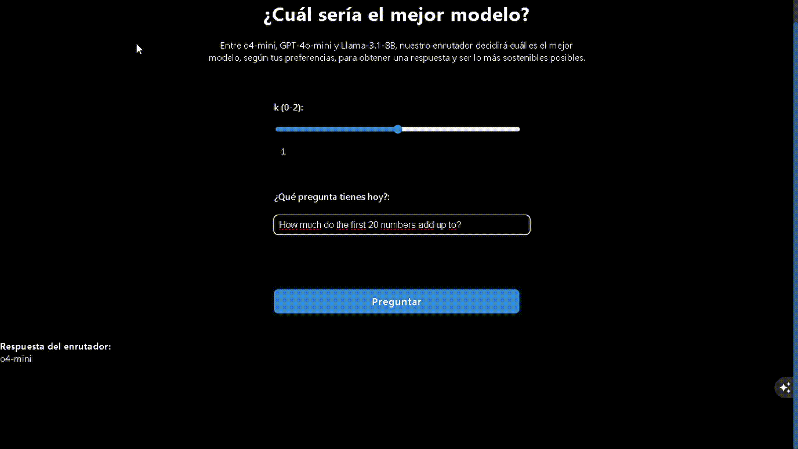

# EnrutIA

## Motiviación del reto

En el uso diario, cada consulta a un modelo de lenguaje grande consume un promedio de 0.14 kWh de electricidad y 519 ml para una respuesta de 100 palabras, pero al escalar a cientos de millones de peticiones diarias esto se traduce en cientos de MWh, cientos de miles de kilos de CO₂ y millones litros de agua al mes. Este es un problema relevante, ya que algunos LLM consumen mucha más energía que otros sin que ese mayor consumo se traduzca necesariamente en una mejor eficiencia. Las preguntas sencillas o deterministas suelen poder resolverse con modelos ligeros, mientras que, a medida que aumenta la dificultad, es necesario un mayor gasto medio para obtener una respuesta correcta.

Sobre esta idea se construye el Reto UPM–Cotec del IndesIAhack 2025, que busca una solución para emplear los modelos de una manera eficiente, eligiéndose a cual enrutar para obtener una respuesta coherente pero gastando lo menos posible. 

## Descripción

Nuestra propuesta consiste en un enrutador inteligente desarrollado en Python,que haciendo uso de los datos del benchmark y los costes de cada LLM, ya dados, usa Pandas para analisis de datos, haciendo hincampié en la categoria de las preguntas y como los modelos responden.

Para controlar el comportamiento del enrutador introducimos un factor \(k\), con valores entre 0 y 2, que permite configurar el tipo de respuesta que se desea obtener. Un valor \(k = 0\) prioriza siempre el modelo más potente, mientras que \(k = 2\) opta siempre por el modelo más ligero; el valor predeterminado es \(k = 1\), que representa el equilibrio planteado en el reto entre coste y calidad.

La arquitectura del proyecto está pensada para ser flexible y fácilmente adaptable a distintos entornos. En la versión de referencia se utiliza Flask para la interfaz web, aunque no se recomienda su uso tal cual en entornos productivos, y las llamadas al LLM se realizan a través de la API de Groq. Estos componentes pueden sustituirse por modelos locales u otras APIs simplemente cambiando la capa de integración correspondiente; en esos casos, es posible que sea necesario instalar librerías adicionales según las necesidades del usuario.

Actualmente, EnrutIA se centra en decidir qué modelo es el más adecuado para cada consulta y no realiza todavía la llamada al LLM seleccionado; la integración con APIs externas o modelos locales debe configurarse por parte del usuario en función de su entorno y proveedor.


## Estructura del proyecto

- `app.py`: punto de entrada de la aplicación (interfaz web con Flask).
- `enrutador.py`: implementación del enrutador y de la lógica de decisión.
- `excel_to_pandas.py`: utilidades para cargar y transformar datos desde Excel a pandas.
- `obtain_category.py`: funciones para obtener o clasificar categorías a partir de los datos.
- `benchmark/`: scripts y datos para pruebas y evaluación del rendimiento.
- `requirements.txt`: dependencias de Python necesarias para ejecutar el proyecto.
- `LICENSE`: licencia MIT del proyecto.

## Requisitos

- Python 3
- Dependencias indicadas en `requirements.txt`.

## Uso

1. Clonar el repositorio:

```
git clone https://github.com/vvazgonz/EnrutIA.git
cd EnrutIA
```

2. Instalar dependencias:
```bash
pip install -r requirements.txt
```

3. Ejecutar la aplicación:
```bash
python app.py # o python3 app.py, según el sistema
```

Ejemplo de uso:



## Notas y posibles extensiones

- Es necesario configurar las llamadas a los modelos a partir del valor que devuelve actualmente el enrutador, conectándolo con la API o el modelo local que se quiera utilizar.
- El proyecto es escalable: se pueden añadir nuevos modelos al enrutador siempre que se disponga de datos de coste y eficacia para ellos.
- La capa de enrutamiento puede ampliarse con nuevas métricas de coste, calidad o latencia para cada modelo, según las necesidades del caso de uso.
- La integración con LLMs puede adaptarse fácilmente a modelos locales u otras APIs, siempre que se implemente una interfaz compatible.
- La interfaz web basada en Flask actúa como prototipo y puede sustituirse por un frontend más robusto en entornos reales.


## Autores

- Víctor Vázquez González (@vvazgonz)
- Román Hernández de los Mártires (@romanode)
- Alejandro Gómez Alonso
- Fernando Fernández Estemera
